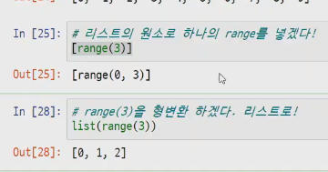

# MEMO(오전의 기억)

- Jupyter notebook

  -  파이썬 대화형 개발 환경 중 하나=> REPL (Read Eval Print Loop)

  - 대화식으로 명령어를 입력하면 출력값을 알려주는 것

  - VSCODE => REPL X    //     jupyter notebook => REPL O 
  - MarkDown 문법을 통해 풍부한 문서화 가능
  - cell 식으로 한줄 한줄 출력 가능

- input() 으로 입력받은건 무조건  `STRING`

- "키워드" X   //   숫자 먼저 X  //  쓸 수 있는데 X(print)

- jupyter notebook 은 마지막 줄을 Out 으로 나타냄

  - print()를 사용 할 경우는 Out 표시없이 무조건 출력

- 하나의 값 => 표현식 //  a=10 => 할당문 (표현식X)

  - print(10) == 10 ?  XXX  아님 값이 아니라 그냥 출력임 

    고로 그냥 표현식

## 단축평가 (중요)★

- 연산자 and or 는 결과값이 피연산자 두 개 중 한개로 나온다.

- A and B  =>  A와 B 둘다 True 여야 True 이여서 B 까지 확인

  - ★즉 and 에서 앞이 거짓이면 무조건 앞에거 출력!★

  - ex) 'A' and 'B'  => 'B'  로 출력됨 뒤에 것 까지 확인해야 하므로!

- A or B  =>  A와 B 둘 중 하나만 True 거나 False 면 되니까

  - ★즉 or 에서 앞이 참이면 무조건 앞에거 출력!★

  - ex) 'A' or 'B' => 'A'  A만 확인하면 되므로!

- 결국 앞이 참이거나 거짓이면 and or 에 따라 뒤에 계산을 안함

```python
vowels = 'aeiou'
('a'and 'b') in vowels   # False 앞에 연산 먼저하니까
('b'and 'a') in vowels	 # True
```

## Identity

문자열/숫자  => 특정범위에서의 주소값은 같음

ex)

```python
a=[]
b=[]
print(a==b, a is b)  # True , False
print(id(a),id(b))	 # 값은 같아도 주소는 다름
```

```python
a='hi'
b='hi' #특정 범위문자열/숫자는 같은 주소!! -5~256 id 동일   
a is b   # True/주소값도 같음

a=1
b=1
print(a is b)  # True/주소값도 같음

------------ BUT -------------

a='hi!'
b='hi!' # 느낌표 때문에 같지 않음!!
a is b   # False 
```

----------------------------------------------------------------------------------------------

# MEMO(오후의 기억)



- 위에 경우 [] 안에 range를 넣은 것과 range(3)을 list로 형변환 하겠다 차이!

```python
phone.keys()     # keys() 와 values() 는 유사 list 이건 list 만 있음.
phone.values()
phone.items()  # 유사 리스트로 리스트로 변경해서 볼 수 있는데 하나하나 뜯어보면 					(key1,key2)로 이루어진 tuple 이다.
```