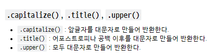
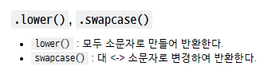
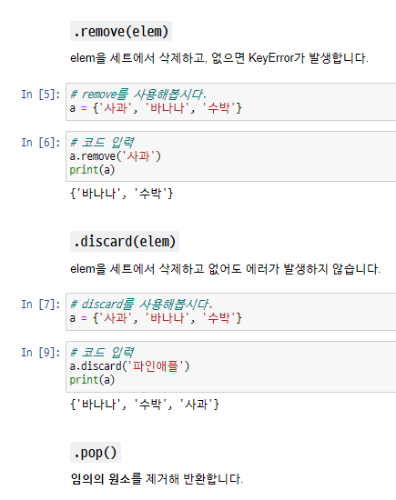

# MEMO

- find() // index()
  - find 의 경우 그 요소가 없다면 -1 반환
  - index 의 경우 그 요소가 없다면 __substring not found__ error 가 일어남
- replace(word,newword,count)
  - count 경우 앞에서부터 몇번 그글자를 new글자로 대체 할 것인지

- strip() => 앞 뒤 공백제거
  - lstrip / rstrip => 왼쪽 / 오른쪽 공백 제거.

- split('char') => 문자열을 char 로 나누어 리스트로 반환





- ```py
  .isalpha(), .isdecimal(), .isdigit(), .isnumeric(), .isspace(), .isupper(), .istitle(), .islower()
  ```

  - __문자열__을 확인하는 메소드 (참/거짓 반환) 

- __리스트 복사__
  - 리스트는 복사하면 같은 주소를 가르쳐서 바뀐 것을 바꿔도 원본도 바뀜
  - deep copy를 하면 아예 새로 생성해서 카피하는 것!

- filter / map
  - filter 는 True 인 것만 반환 / map 은 모든 요소 반환


- 제거 함수들 구분!!



