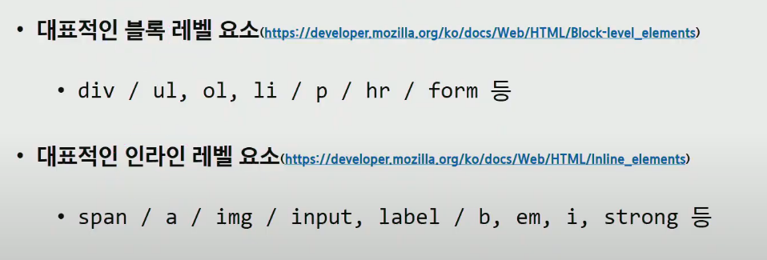
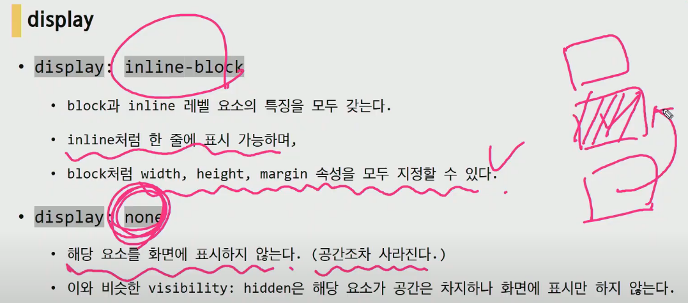

# MEMO

### HTML

- 크게 <head> 와  <body> 로 나눌 수 있는데 우리가 보는 web은 <body> 부분임
  /<head> 부분은 메타데이터로 전체적인 웹문서가 무엇인지 알려줌 카톡에서 링크
  보낼때 밑에 사진박스 나오는 것이 <head> 부분임

- 요소(element)

  - #<h1>contentents</h1>

    #

    태그 별로 속성명이 다르다. a 태그의 속성은 href 이다.

- 이 외에도 여러가지 태그가 있는데 코드를 작성하면서 익히면 된다!
- checked required autofocus 등 은 부가적인 기능 차차 알아가면 됨

### CSS

- 기본 선택자
  - h1{color : blue ~~}
  - class 선택자는 . 으로 선언해줌 (같은 우선순위 이면 코드순서상 밑에 것이 출력)
  - id 선택자는 # 으로 선언 ( 단, id는 중복하면 안됨 (에러는 안남))
  - 자식 결합자는 > 로 표현해줘서 .box > p 라하면 box 클래스 바로 안에 p 태그 선택
  - 자손 결합자 공백으로 표현해줘서 그 안에 있는 모든 태그들을 말함
-  상속 되는것 
  - text 와 관련된 font color , size 등 ⭕
  - 위치 패딩 border 등 ❌

- (상대) 크기 단위
  - px
  - %
  - em 요소에 지정된 사이즈에 상대적 사이즈 (부모 사이즈의 영향)
  - rem (html의 사이즈를 기준)
  - Viewport 기준 단위

- 색상 단위
  - 색상 키워드
  - RGB 색상
    - -# + 16진수 표기법
    - rgb() 함수 표기법
  - HSL 색상 ( 잘안씀 )
    - 색상,채도,명도

### CSS BOX MODEL

- Margin ( 시계방향으로 설정 )
  - border
    - padding
      - content

- Margin은 div 끼리 상쇄가 일어날수있음.

### CSS Display

