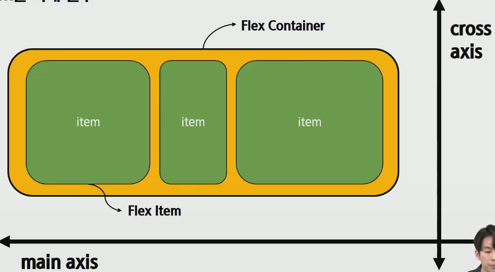

# MEMO

### CSS-Postion

- 기본적인 position => static 임 
  - absolute => static이 아닌 부모를 기준점으로 잡는다. (전체화면을 기준으로 삼는다.)
    __position : relative 를 지정하면 전체화면이 아닌 그 class를 기준으로 absolute 동작!!__
- float => flex 가 나온 이후로 원래 기능이였던 왼쪽정렬,오른쪽정렬로 쓰임

  - clearfix::fater..?

### FLEX



- Container 로 안의 item을 다룸
- 배치 방향 설정
  - flex-direction ( 메인 축 방향 )
- 메인축 방향 정렬
  - justify-content
- 교차축 방향 정렬
  - align-items,align-self,align-content
- 기타
  - flex-wep,flex-flow,flex-grow,order

💥__FLEX 요소__💥

- __첫 시작은 항상 부모 요소에 

  ```css
  display : flex;
  ```

1. Flex-direction (__메인축이 가로냐 세로냐__)
   1. main-axis 방향만 바뀐다.
   2. flexbox는 단방향 레이아웃이기 때문이다.
2. flex-wrap : wrap ( 요소들 강제로 한줄로 배치할 것인지? )
3. flex-flow : column wrap; ( 1,2 번 한꺼번에 쓰는 것)
4. justify-content (메인축 정렬 ➡⬅ ) // align-items (교차축 정렬 ⬆⬇)
5. 그 외
   1. order : 순서를 몇번째로 할 것인지 (__현재 위치 0 기준__)
   2. flex-grow : __빈 공간을 항목들에게 비율로 분배__
   3. align-self : __교차축 기준으로, 부모컨테이너 의 상대적인 위치__


# BootStrap

- 클래스명으로 css를 다룸.

- 보통 link 로 주소를 정해줘서 사용함 (CDN 을 넣어줘야함)

  - `<link href="https://cdn.jsdelivr.net/npm/bootstrap@5.0.0-beta1/dist/css/bootstrap.min.css" rel="stylesheet" integrity="sha384-giJF6kkoqNQ00vy+HMDP7azOuL0xtbfIcaT9wjKHr8RbDVddVHyTfAAsrekwKmP1" crossorigin="anonymous">` => CSS

  - `<script src="https://cdn.jsdelivr.net/npm/bootstrap@5.0.0-beta1/dist/js/bootstrap.bundle.min.js" integrity="sha384-ygbV9kiqUc6oa4msXn9868pTtWMgiQaeYH7/t7LECLbyPA2x65Kgf80OJFdroafW" crossorigin="anonymous"></script>` => Java Script

### BootStrap Grid

- ```html
   <div class="container">
      <div class="row">
        <div class="col"></div>
        <div class="col"></div>
        <div class="col"></div>
      </div>
    </div>
  ```

  - 기본형식은 이렇게. 다양한건 06 html 코드로 확인하자.


### html

- .class + tab : div class명으로 만들어줌

  - div > ul > li*4  => div 안에 ul 안에 li4개 만들기
  - div > ul+li  =>  div 안에 ul , li 형제관계

  - li*4{항목 $} => li 로 항목 1,2,3,4 4개 만들어줌
  
  - ctrl + alt 위,아래 다중커서