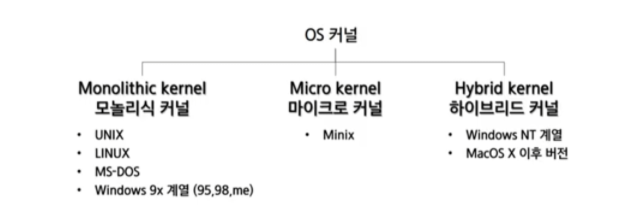
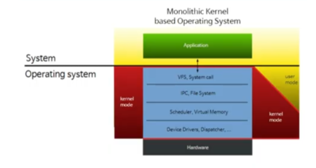
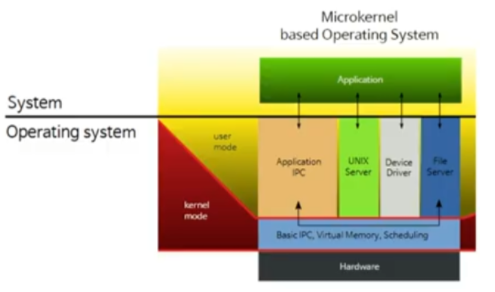
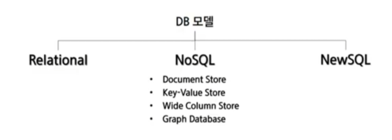

### 학습목표

1. 인프라에 필요한 구성 요소와 자원들의 형태를 알 수 있다.
2. 현존하는 OS의 커널의 종류와 특징을 알 수 있다.
3. 데이터를 저장하는 방식의 종류와, 그에 대표적인 DB 제품들의 특징들을 알 수 있다.

## OS(운영체제)

1. Monolithic kernel (단일형 커널)

   

   : 각 기능간의 커뮤니케이션이 좋고, 시스템 호출에 의한 서비스가 빠름

   ex) UNIX, LINUX, MS-DOS, Windows 9x 계열

2. Micro kernel (마이크로 커널)

   

   : 한쪽 커널에서 오류가 나도 운용될 수 있다. 리얼타임 성 시스템에 강하고 견고하다. 통신은 메시지 전달을 통해서만 발생하기 떄문에 전반적인 퍼포먼스는 저하

   ex) 임베디드 시스템이나 portable한 개발에서 사용하면 좋다.

3. Hybrid kernel (하이브리드 커널)

   

   : IPC는 커널을 두고 파일 시스템은 유저모드에 디자인드

## Database

1. Relational Database
   1. Atomicity, Consistency, Isolation, Durability
   2. Normalization - 1NF, 2NF, 3NF
   3. Scalability (Scale-up, no scale out)
   4. ANSI SQL 문법, JOIN 기능
   5. ex) MySQL, PostgreSQL 등
2. NoSQL
   1. 특징
      1. Auto Balancing
      2. Integrated Caching
      3. Lack of schema
   2. 종류
      1. Document Store
         - XML 등으로 데이터를 저장한다.
         - ex) Mongo DB, Couchbase
      2. Key-Value Store
         - 단순한 구조라 빠르기에 엑세스에 빠르다. 휘발성 때문에 정보 저장보단 상태 표현을 쓴다.
         - ex) Redis, Memcached
      3. Wide Column Store
         - Row 별로 저장하며, 각 Row에 Column을 저장할 수있고, 다양한 매핑할 수 있다.
         - 많은 정보를 처리할 때 좋다.
         - ex) Apache Hbase, cassandra
      4. Graph Database
         - 데이터를 노드로 표현, 관계를 엣지로 표현한다.
         - 직관적이고 시각적이라 상호관계를 바로 볼 수 있고, 유연한 구조이다.
         - 소셜 네트워크에서 많이 사용한다.
         - ex) neo4j
   3. 정리 : 금융권에서는 사용하지 않는다.
3. New SQL
   1. Paritioning/Sharding
   2. Concurrency Control
   3. Rplication
   4. Crash Recovery
   5. ex) UnoDB, Cockroach DB