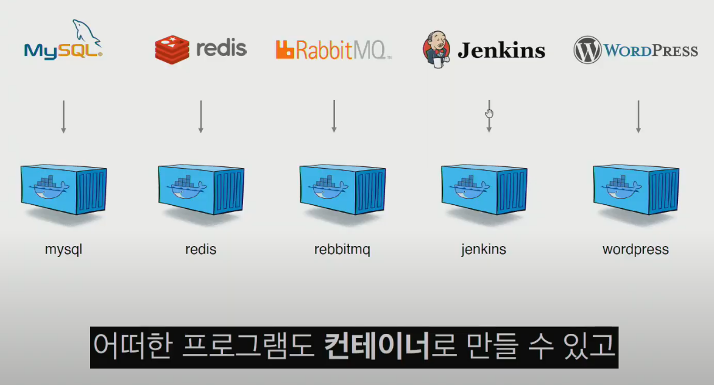
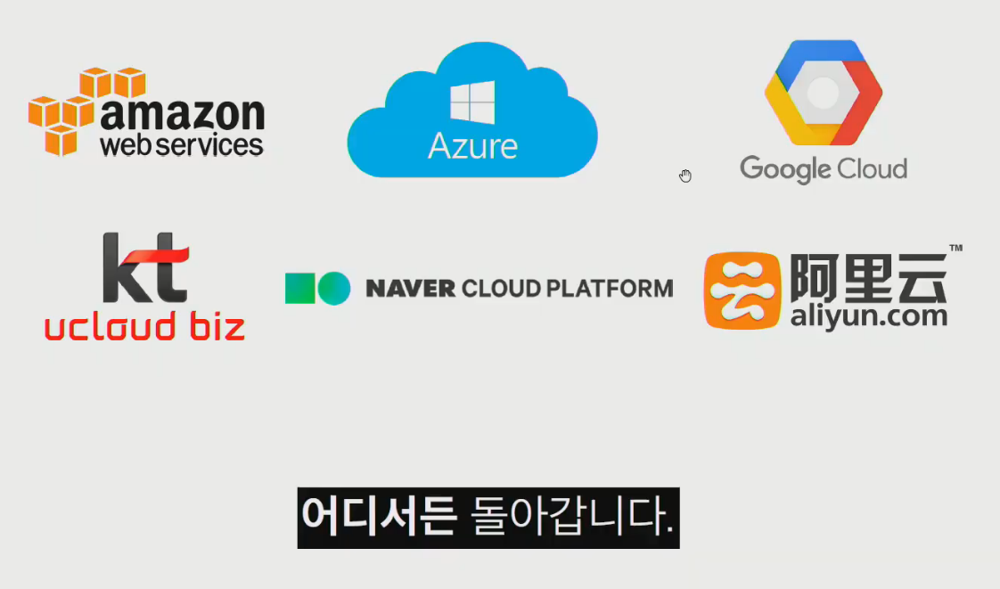

# 도커와 쿠버네티스 실전활용

### Devops 엔지니어가 하는 일

개발 프로세스

- Developer - 코드작성
- Git - Merge Request or Push
- CI - Test Build
- CD - Deploy
- Server - cloud

### 서버를 관리한다는 것

자체 서버 운영 => 설정 관리 도구 => 가상머신 => 클라우드 => PaaS => 도커 => 쿠버네티스 => 서비스 메시

- 자체 서버 운영
  - 서버 주문 > 서버 설치 > CPU, 메모리, 하드 조립 > 네트워크 연결 > OS설치 ..
    - 서버 설정위해 많은 노력 시간 필요
    - 성능이 좋은걸 미리 구매하고 여러 app을 설치
- 설정 관리 도구
  - 코드로 보니 편하긴 하나 공부를 해야함, 한눈에 보기에는 어려움
- 가상머신
  - 한 서버에 여러개 설치 쉬움 / 현재 상태 저장 가능
  - 처음부터 세팅시 문제 / 프로그램이 무거워서 느림
- 클라우드
  - AWS, Google Cloud, Azure,,,
  - 하드웨어 파편화 문제 해결 / 이미지를 기반으로 한 다수의 서버 상태 관리
  - 서버 운영의 문제는 여전히 남아 있음 (누군가 들어가서 관리 해야함)
- PaaS
  - Heroku, Netlify, AWS Elastic Beanstalk, Google Cloud App Engine, ...
  - 서버를 운영하는 것은 복잡하고 어렵다
  - 소스 코드만으로 배포가 가능
  - 단점
    - App을 Paas 방식에 맞게 작성
    - 서버에 대한 원격 접속 시스템 제공 X
    - 서버에 파일 시스템 사용 X
    - Site 패키지 설치 X
    - 로그 수집을 제한적인 방식으로 허용
    - App 배포에 대한 새로운 패러다임

### 도커와 쿠버네티스의 등장

- 도커란?

  - 워드프레스 경우 PHP + MySQL 같이 실행시켜야 했던 불편함이 명령어 하나로 실행이 가능해짐
  - Docker compose up : 명령어 하나로 실행 가능

  

  

  - 가상머신 처럼 __독립적으로 실행__ 되지만 가상머신보다 __빠르고__ __쉽고__ __효율적__이다.
  - 자원격리 기능 (어려운 기술 구현인데 손쉽게 구현 가능)
  - 도커가 가져온 변화
    - 클라우드 이미지보다 관리 쉬움
    - 다른 프로세스와 격리되어 가상머신처럼 사용하지만 성능저하 없음
    - 복잡한 기술 몰라도 사용 가능
    - 이미지 빌드 기록 남음

- 도커 그 이후

  - 도커로 관리할 서버,app이 많아지면 롤백/롤아웃 손이 많이 감
    - 왜? 많으니까 컨테이너 들이

  - 컨테이너 오케스트레이션 등장 __( 쿠버네티스로 표준화가 되었음 )__
    - 여러 컨테이너를 하나의 cluster로 보고 master로써 관리함
    - 상태관리, 스케줄, 롤백 등 관리 편함

- 쿠버네티스란?

  - 컨테이너를 __쉽고 빠르게 배포/확장__하고 __관리를 자동화__해주는 오픈소스 플랫폼

  

### 배포 프로세스 개선하기

- 배포 프로세스 고민
  - 배포를 더 자주 / 빠르게 / 많이 / 자유롭게 ?
- Git ops - 깃에 어디다가 배포할지 써놓으면 쿠버네티스가 판단하에 실행

### Devops 엔지니어

- DevOps 역할
  - 서비스 배포, 모니터링
  - 배포 파이프라인 구성
  - 빠른 릴리스
  - 컨테이너 / 보안네트워크 / 장애대응
  - IaC / SRE - SLI, SLO / 외부서비스