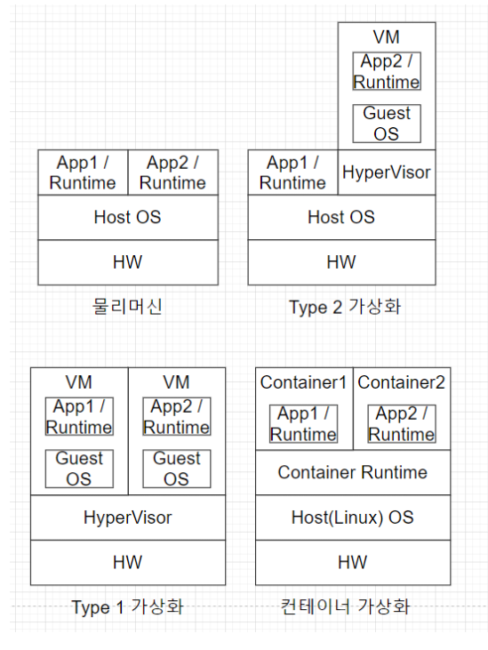

✔ AWS가 2006년도에 처음 클라우드 서비스를 출시하고 시간이 많이 흐름

### ☁️클라우드?

- 사용자 - 공유기 - 인터넷
- 전통적으로는 IDC ( Internet Data Center)라고도 함
  - 현재는 클라우드 데이터 센터를 제공하기도 함
    - 컴퓨터 리소스 센터
    - CPU, 스토리지, 네트워크 등 서비스로 이용이 가능함
- 각각의 서버를 호스트라고 하고 클라우드 이전에도 임대해서 운영할 수 있게 해주는 웹 호스팅 서비스가 있었음
- `전 세계 데이터센터에 있는 수백만대 컴퓨터가 긴밀하게 연결해 만들어낸 가상 공간`
- AWS는 여러 가지 리소스를 클라우드 형태로 제공하고 있음

### 🖥️클라우드 컴퓨팅

- 인터넷("클라우드")을 통해 온디맨드로 컴퓨팅 서비스를 제공하고 사용한 만큼 비용을 지불하는 것
- 장점 : 비용, 속도, 성능, 확장성, 생산성, 안전성, 보안
- Window 365?
  - 인터넷 웹 브라우저만으로 윈도우를 사용할 수 있음

## 🖥가상화 기술

- `물리적 특성을 숨기고 사용자에게 추상화된 가상 자원을 제공하는 기술`

  - 서버 가상화, 스토리지 가상화, 네트워킹 가상화, 컨테이너 가상화

- 가상화가 어디에 올라가는 지에 따라 구분이 가능

  

### Type2 가상화

- 응용프로그램 입장에서는 게스트 OS, 하이퍼 바이저, 호스트 OS, 하드웨어라는 레이어를 많이 거침
- 오버헤드가 심함
- SW를 통해 다양한 OS를 쉽게 사용할 수 있다는 장점이 있음

### Type1 가상화

- VM 전용으로 많이 활용하는 방식
- 오버헤드를 조금이라도 줄임

### 컨테이너 가상화

- 하이퍼 바이저가 없이 컨테이너 런타임을 설치한 다음, 다양한 OS와 어플리케이션을 격리
- 호스트의 자원을 파티셔닝해서 오버헤드 적게 사용할 수 있음

### 윈도우 가상화

- WSL2 Architecture

### 클라우드의 활용 사례

- 예전에는 노트북에서 작업하고 USB로 옮기는 작업이 기본이었음
- 클라우드 스토리지 서비스
  - dropbox, icloud, Google Drive
- 스트리밍 서비스
  - NETFLIX, luna, XBox GamePass, Amazon luna, google stadia

### 클라우드 - 기업

- Rack 형태의 서버를 구매해서 기업 내부에서 24시간, 365일 서버실이라는 전용 랙에 관리를 했었음
  - 서버를 유지하고 구매하는 데 시간과 비용이 너무 많이 듬
- 이러한 대안으로 퍼블릭 클라우드를 찾음
  - 이미 다양한 물리적인 서버 위에, 원하는 스펙에 원하는 수량 만큼 VM을 여러 개 올릴 수 있음
- 클라우드는 유연하게  트래픽에 맞게 생성할 수 있음
- 서비스를 클라우드로 이전하고 기존에 가입했던 전용선 해지하고 그쪽에서 서비스를 받게 끔 트래픽을 돌려 안정적인 서비스 운영이 가능해짐
- 예전에 자체 데이터 센터를 구축해서 인력을 상주시켜 했었다면
  - **On-Premise 방식!**
- 요즘에는 클라우드로 시작을 함
- 가입해서 사용할 수 있는 방식 - 퍼블릭 클라우드 방식
- 고스펙의 원하는 입맛대로 하는 하이브리드 클라우드 전략도 있음
- AWS로 서버가 다운되거나 장애가 발생하지 않는 것은 아님
  - 멀티 리전에 가입 또는 멀티 클라우드 서비스로 정말 중요한 서비스를 유지시킨다

### 클라우드 서비스 모델 비교

- 전통적인 IT
- IaaS
  - 인프라를 제공받아 이용하는 것
- PaaS
  - 사용자가 어플리케이션과 데이터만 관리해서 이용
- SaaS
  - 어플리케이션도 서비스를 제공받아 이용
- Firebase는 다양한 백엔드 기능을 클라우드 상에서 제공을 해줌
  - 웹을 개발하든, 모바일을 연동하든 핵심 서비스를 빨리 개발해서 런칭을 해보고
  - 잘 된다면 바로 적용하는 등, 기술적인 리스크를 줄이고 도움이 되게 할 수 있음

### 클라우드 서비스 Link

- aws 설명

  https://adayinthelifeof.nl/2020/05/20/aws.html

- google cloud 설명

  [GitHub - gregsramblings/google-cloud-4-words: The Google Cloud Developer's Cheat Sheet](https://github.com/gregsramblings/google-cloud-4-words)

- Amazon lightsail을 사용해보는 것도 좋음

### 클라우드 강좌 소개

https://opentutorials.org/module/3814

https://www.youtube.com/channel/UCpDxKxars7BHR3owaNRctaQ

### 정리

✔ 클라우드와 가상화의 기본적인 개념을 이해하자

✔ 클라우드의 구축 형태와 서비스 제공 범위에 따른 모델을 구분하자

✔ 기업뿐 아니라 개발자도 클라우드 환경을 잘 이해하고 활용하는 능력이 경쟁력을 높인다.

------

### Daily Contents - Restful API

[[Network\] REST란? REST API란? RESTful이란? - Heee's Development Blog](https://gmlwjd9405.github.io/2018/09/21/rest-and-restful.html)