CS기본지식의 필요성 및 개요

1. 컴퓨터(시스템)에 대한 이해 (컴퓨터와 제대로 소통하기)
2. 자료구조,알고리즘 활용법 (일의 효율을 높이기)
3. Coder에서 Developer로 성장
4. 기업목적에 따는 기본적 CS지식이 필요 (게임회사, sns회사에 필요한 지식은 다름)

- CS핵심 이론

  - 소프트웨어 공학

    - 1. 소프트웨어 위기에 대해서 설명

         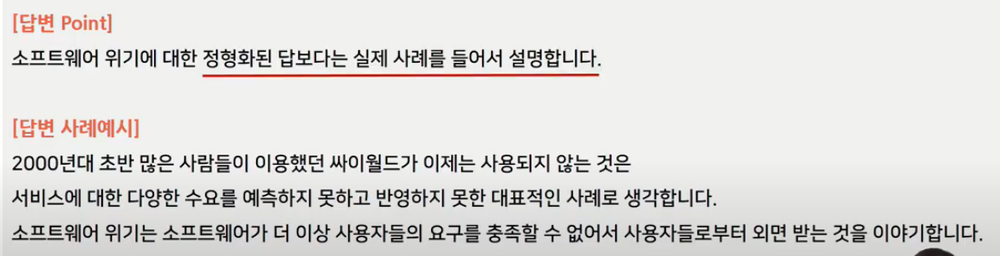

      2.소프트웨어 공학이 필요한 이유

      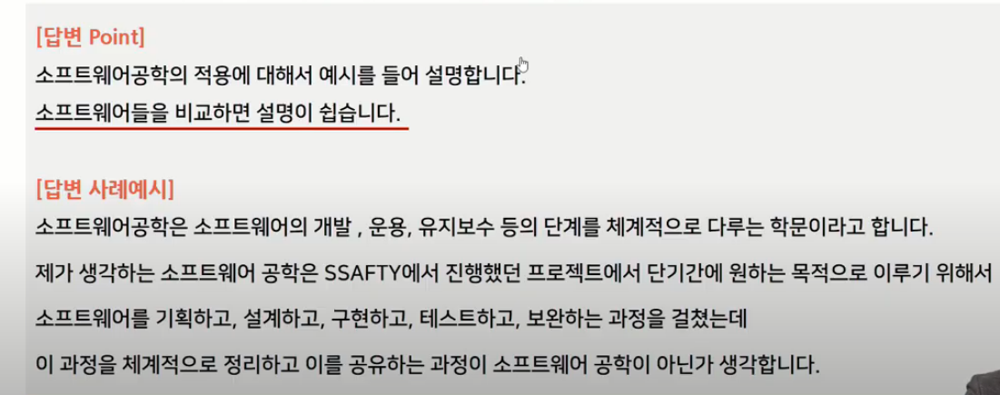

      3.소프트웨어 개발 경험 / 개발시 적용한 개발 방법론 설명

      

      4.소프트웨어 프로젝트 진행 경험 설명

      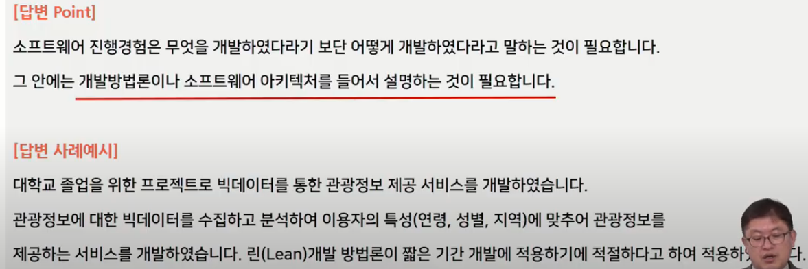

  - 프로그래밍

    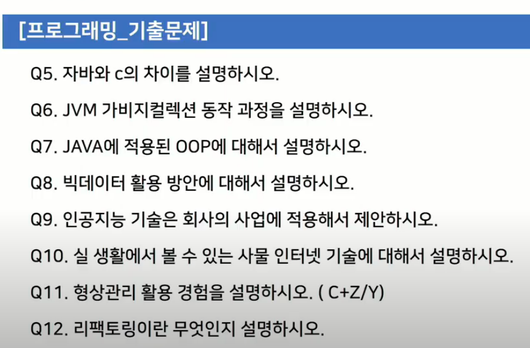

    - 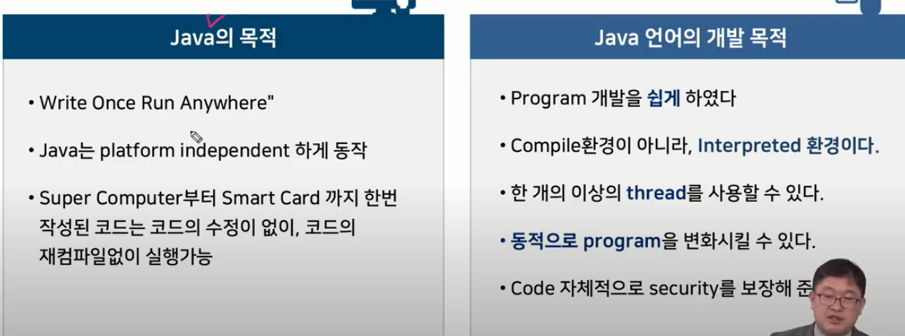
    - 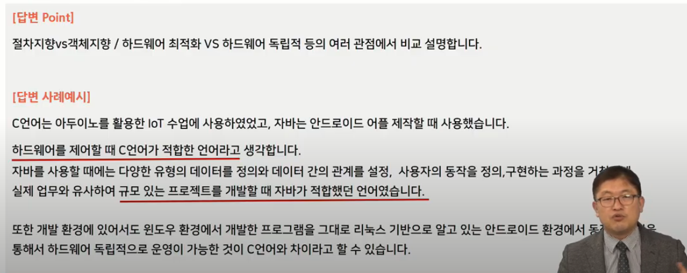
    - 
    - 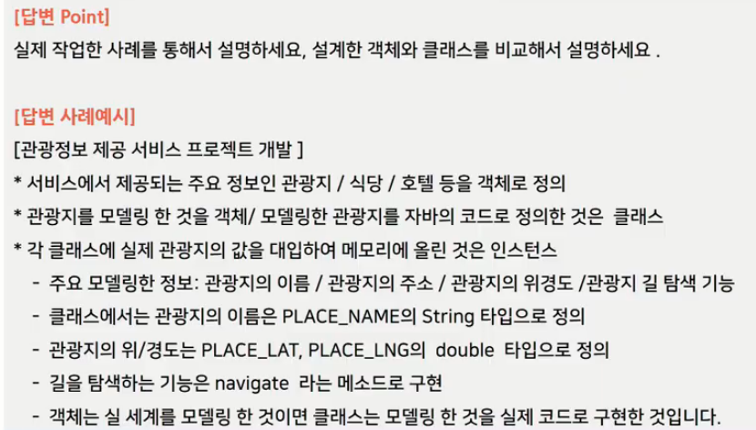
    - 
    - 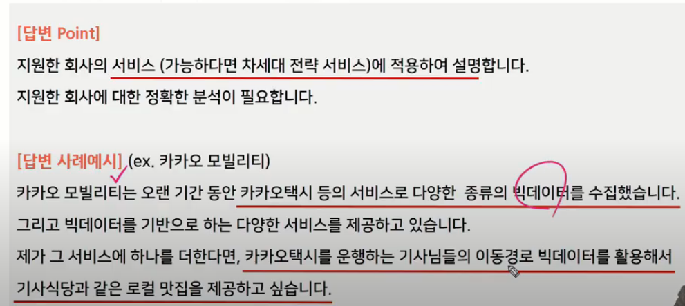
    - 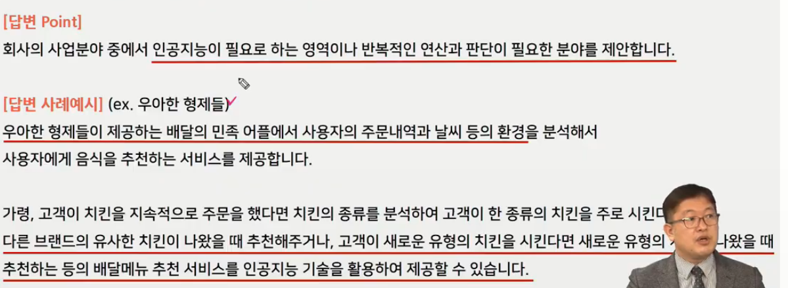
    - 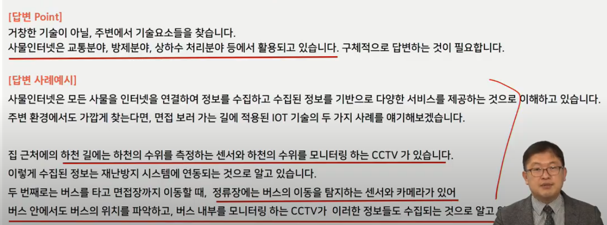

  - 데이터베이스

    - 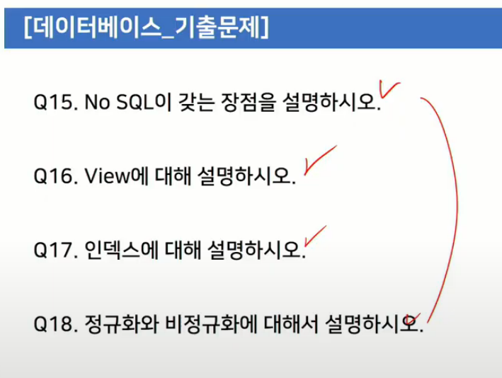
    - 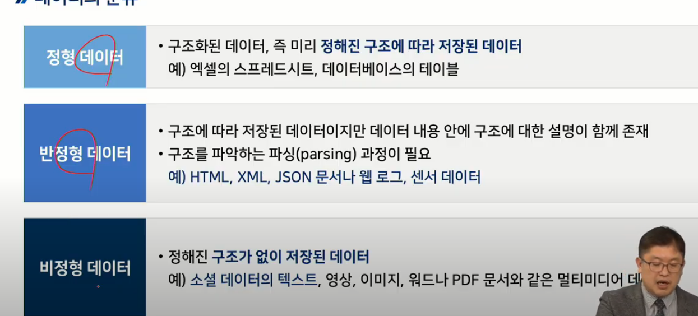
    - 

    - 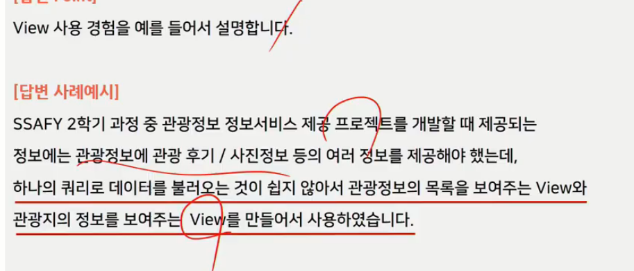
    - 

  - 웹&모바일

    - 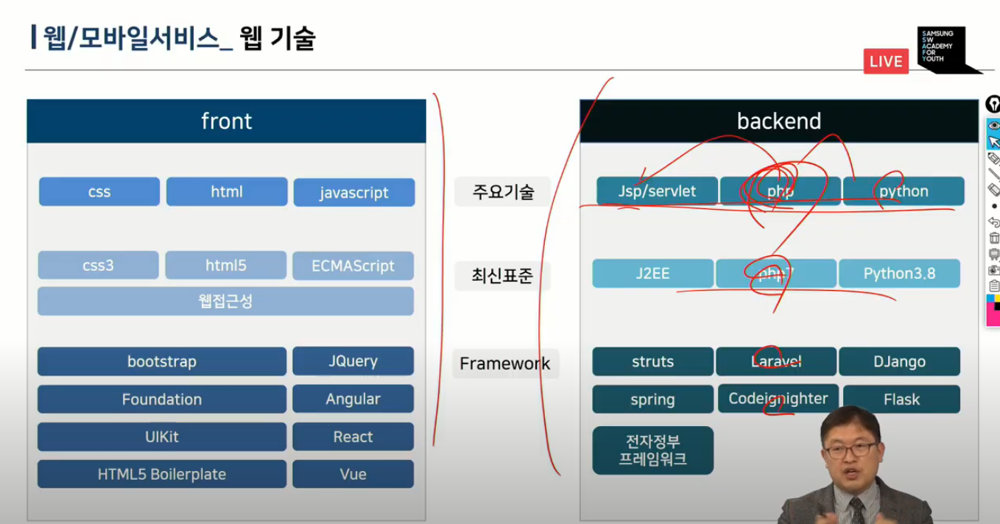
    - 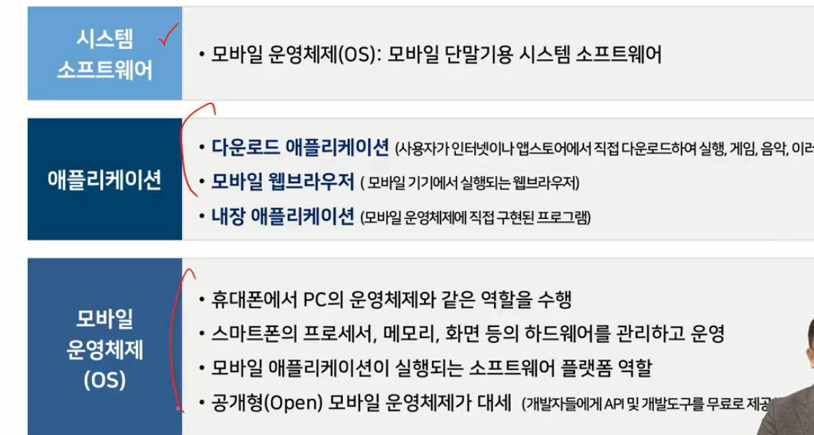
    - 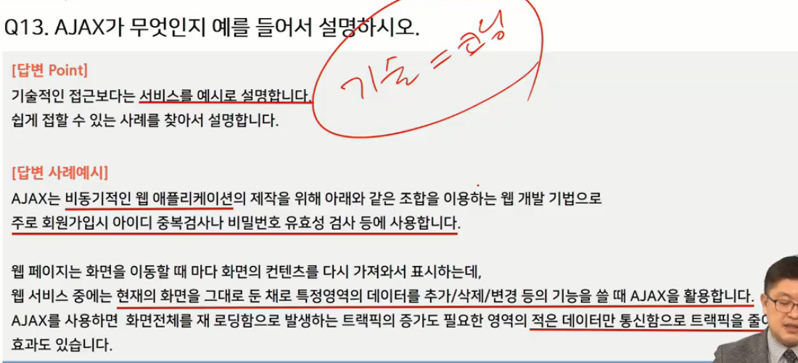

  - 네트워크