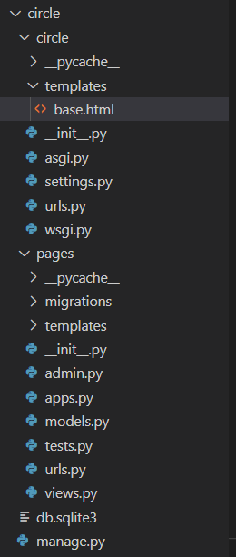
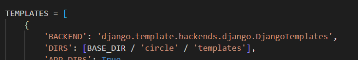
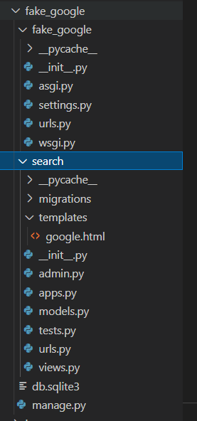
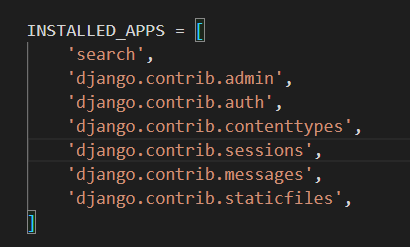

# 장고

###  + 문제 주소창에 반지름 입력받고 원넓이를 화면에 출력

- 제일 먼저 settings.py -> INSTALLED_APPS 리스트안에 app명을 적어줘야함.

project urls.py 안에 이번에는 include 를 사용하여 app urls 로 관리할 수 있게끔 해봤다.

```python
from django.contrib import admin
from django.urls import path,include

urlpatterns = [
    path('admin/', admin.site.urls),
    path('pages/', include('pages.urls')), # pages app으로 이동하고 그 이후엔 pages/urls 에서 											   관리 한다.
]
```

그리고 base.html 을 project 하위 templates 폴더에 만들어서 사용하였다.

```html
<!DOCTYPE html>
<html lang="en">
<head>
  <meta charset="UTF-8">
  <meta http-equiv="X-UA-Compatible" content="IE=edge">
  <meta name="viewport" content="width=device-width, initial-scale=1.0">
  <title>Document</title>
</head>
<body>
    <!-- content 는 블럭이름으로써 사용할 html과 연결하려고 -->
  	<!-- 블락 사이가 이제 사용되어질 부분이라는 것을 알려줌-->
</body>
</html>
```

- 폴더 구성은 이러함



- base.html 을 사용하려면 settings.py -> TEMPLATES -> DIRS 를 수정해줘야함.



- BASE_DIR 이란 project 디렉토리 안에 circle 폴더 안에 templates 폴더를 의미

__pages 디렉토리 안에 urls.py __

```python
from django.urls import path
# 명시적 상대경로 표현
from . import views

urlpatterns=[
    path('circle/<int:r>/', views.circle, name='circle'),
]
```

즉 경로는 /pages/circle/숫자

__views.py__

```python
from django.shortcuts import render

# Create your views here.
def circle(request,r): #주소창에 반지름을 입력하므로 반지름 r 도 매개변수로 입력받음
    S=3.141592*(r**2)
    context={
        'r':r,
        'S':S,
    }
    return render(request, 'circle.html', context)
```

__circle.html__

```html

 <!-- content 블럭 안에 쓸것이라는 것을 알려주는 블럭 -->
  <p>반지름: {{ r }}</p>
  <p>원의 넓이: {{ S }}</p>

```

base.html 을 상속받아 조금 더 간편하게 작성할 수 있다.

## + 문제 fake-google 검색 사이트 만들어라

__디렉토리 구성__



__fake-google -> urls.py__

```python
from django.contrib import admin
from django.urls import path,include

urlpatterns = [
    path('admin/', admin.site.urls),
    path('search/', include("search.urls"))
]
```

- 마찬가지로 settings.py 에 INSTALLED_APPS 리스트에 app 이름을 적어줘야한다.
- BASE.html 은 사용하지 않아서 DIR에 디렉토리 경로는 입력 안해도 된다.



__search/urls.py__

```python
from django.urls import path
# 명시적 상대경로 표현
from . import views

urlpatterns=[
    path('google/', views.google, name='google'),
]
```

- /search/google  로 주소창을 적어야함

__search/views.py__

```python
from django.shortcuts import render

# Create your views here.
def google(request):
    return render(request, 'google.html')
```

- 검색만 이용하기에 렌더링만 시켜주었다.

__search/templates/google.html__

```html
<!DOCTYPE html>
<html lang="en">
<head>
  <meta charset="UTF-8">
  <meta http-equiv="X-UA-Compatible" content="IE=edge">
  <meta name="viewport" content="width=device-width, initial-scale=1.0">
  <title>Document</title>
</head>
<body>
  <h1>검색어를 입력하시오</h1>
  <form action="https://www.google.co.kr/search" target="_blank">
    <input name="q" type="text" placeholder="검색어를 입력">
    <input type="submit" value="검색">
  </form>
</body>
</html>
```

- form action 부분에 구글 검색 주소를 입력하여 __input name="q"__ 에 해당하는 검색어를 입력하면 검색 💥💥name ="q"💥💥 가 구글 검색창에 단어를 입력해 찾아주는 부분으로 안쓰면 검색이 안된다 !