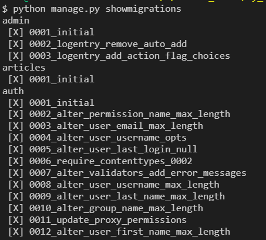
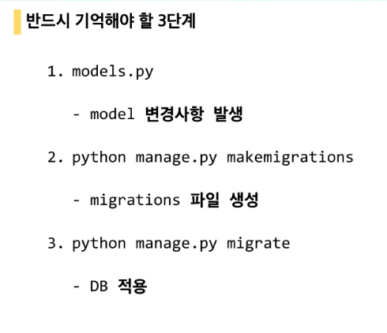
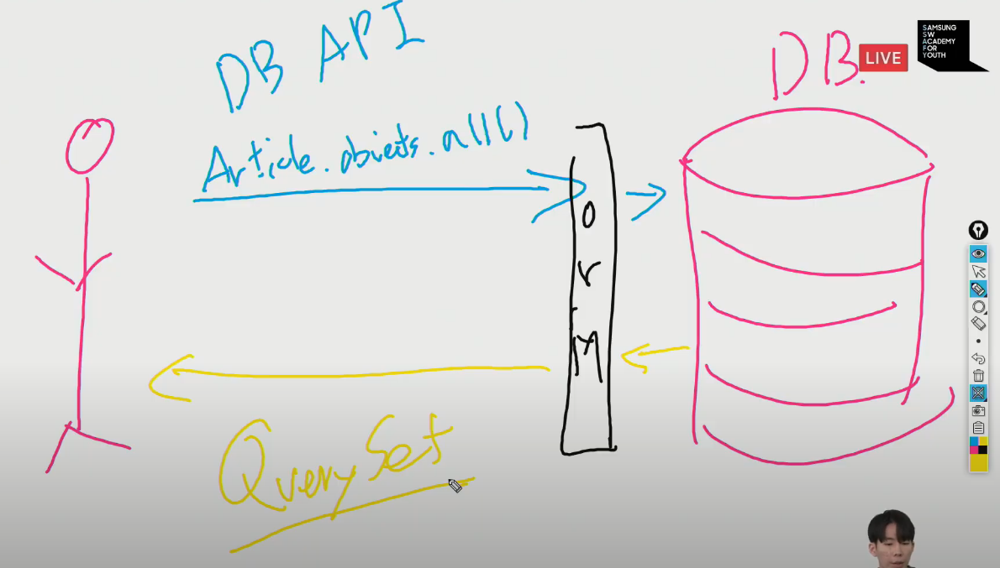
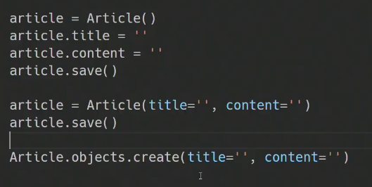
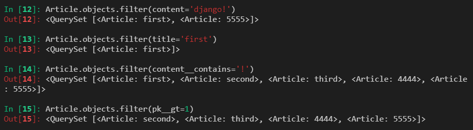
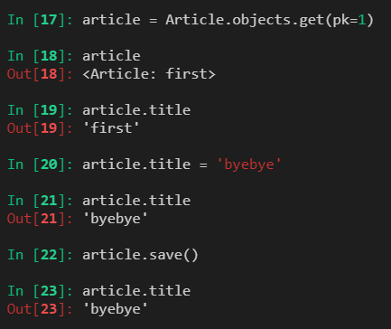
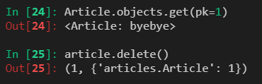

# MODEL

- 웹 어플리케이션의 데이터를 구조화하고 조작하기 위한 도구
- 모델은 데이터베이스와 같지 않다 (모델 > 데이터베이스)

- 필드/열,  레코드/행
- Modelfield -> auto_now_add : 작성되는 시간(처음저장) / auto_now : 수정(저장될때마다)

# Database

- 스키마 - 데이터베이스의 구조와 제약조건에 관련한 전반적인 명세
- 열(Column) - 각 열에는 고유한 데이터 형식이 지정
- 행(Row) - 데이터는 행에 저장 (데이터 하나하나)

- PK(기본키) - 레코드의 고유값 반드시 설정해야하며 관리 및 관계 설정시 활용

# ORM

- 호환되지 않는 유형의 시스템간에 데이터를 변환하는 프로그래밍 기술
  - 가상 객체 데이터베이스를 만들어 사용
  - ex) DB = SQL / Code = python  => ORM 을 이용하여 서로 호환

- __DB를 객체로 조작하기 위해 사용__

# Migrations

- 장고가 model에 생긴 변화를 반영하는 방법

  - __makemigrations__

    - model을 변경한 것에 기반한 새로운 마이그레이션(설계도)을 만들 때 사용
    - python manage.py makemigrations 명령어

  - __migrate__

    - 마이그레이션을 DB에 반영
    - 설계도를 실제 DB에 반영
    - 모델에서의 변경 사항들과 DB의 스키마가 동기화를 이룸
    - python manage.py migrate (sql 테이블 생성)

  - sqlmigrate

    - 마이그레이션이 sql문으로 어떻게 해석되어서 동작할지 미리 확인

  - showmigrations

    - 마이그레이션 상태확인 / migrate 됐는지 안됐는지 여부 확인

      

    - x 표시는 체크했다는 표시이다.

- 오늘 한 것 !!! 가장 중요‼‼‼‼

# Database API

- INSTALLED_APPS 에 앱이름과 더불어 django_extensions 추가 해줘야함.

- python manage.py shell_plus ( 모든 모듈 import 해줌)

- DB에 데이터 저장하는 방법 3가지 (Create)
  - 첫번째 : 객체생성 후 title,content 선언
  - 두번째 : `article = Article(title='second',content='django!!')`한꺼번에
    - 위에 두가지 방법은 `article.save()` 를 해줘야 DB에 반영
  - 세번째 : `Article.objects.create(title='third',content='django!!!')`
    - 이 방법은 save를 안해줘도 자동으로 입력이 됌

- 조회 하는 방법 (Read)

  - all()
    - 

  - get() - `Article.object.get()`

    - 객체가 없으면  DoesNotExist 에러 발생
    - 객체가 여러개일 경우 MultipleObjectsReturned 에러 발생
    - 위와 같은 특징을 가지고 있기 때문에 unique 혹은 NOT NULL 특징을 가지고 있는 경우에만 사용 가능 (고로 pk 로 조회할때 사용해라)

  - filter()

    

    - filter 는 여러 명령어? 가 있는데 gt는 ~보다 큰 이라는 뜻 contains 는 문자 포함하는것

- 수정하는 방법 (Update)
  - 무엇을 수정할 지 인스턴스를 만들고 값을 정한뒤 save
    - 

- 삭제하는 방법 (Delete)
  - 수정과 마찬가지로 인스턴스로 무엇을 삭제할지 정한뒤 delete()로 삭제 (save)안함
  - 