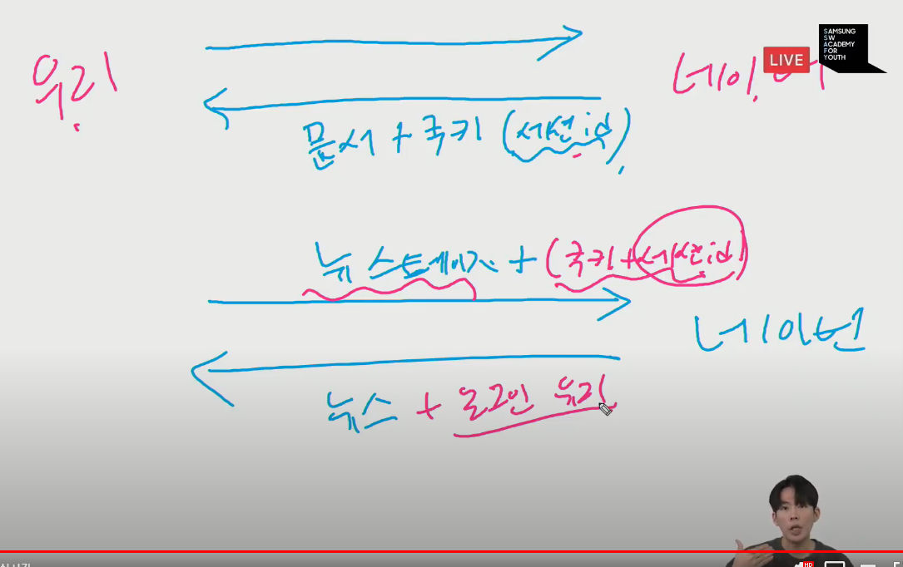

- Authentication : 자신이 누구라고 주장하는 사람의 신원 확인 / 인증
- Authorization : 권한 , 허가

장고에선 인증,권한 부여를 함께 제공하고 일반적으로 __authentication system__ 이라고함.

**User object** / **Webrequest** => 오늘 기억할 키워드

### 05_DJANGO_AUTH

보통 user 인증에 관하여 app을 만들때 app명 : **accounts** 라고 씀

- Login
  - 세션을 create 하는 로직과 같음
  - Request 객체와 user 객체를 통해 로그인 진행
  - Django의 session framework를 통해 사용자의 id를 세션에 저장

- Logout

  - 세션을 Delete하는 로직과 같음
  - request 객체를 받으며 return 이 없음

  - 현재 요청에 대한 DB의 세션 데이터 삭제, 쿠키에서도 sessionid를 삭제

- HTTP 특징인 __비연결지향__  __무상태__ 때문에 쿠키에 세션id를 담아서 준다.

