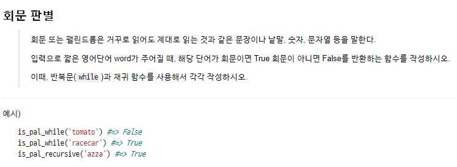

# MEMO

- EOL => End of Line  //  EOF => End of File

- 값을 비교할땐 `if i == True:` i가 그 자체로 비교함 하지만

  `if i:` 로 준다고 한다면 자동으로 i가 boolean으로 바뀌므로 위에와 다름

## Recursion



```python
# recursive

def is_pal_recursive(word):
    if (len(word) < 2):
        return True
    else:
        return ((word[0] == word[len(word) - 1]) and
                is_pal_recursive(word[1:len(word) - 1]))
    
def is_pal_recursive(word):
    if len(word)<2:
        return True
    if word[0]!=word[-1]:
        return False
    else:
        return is_pal_recursive(word[1:-1])
```

