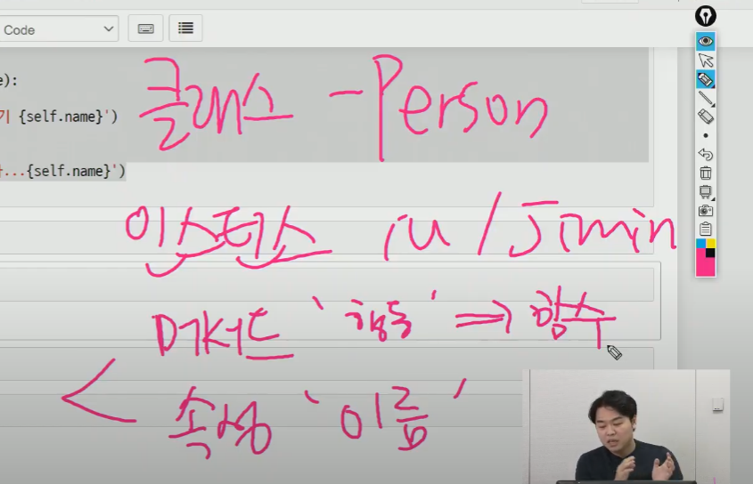

# MEMO

## OOP(객체)

```python
person1=Person()  =>  인스턴스 = 클래스  # 인스턴스 클래스 모두 객체 라고 함
```

(클래스에 정의된 함수 => __메서드__라고 함)

## 속성

- 상태 / 데이터를 말함
  - ex) 3+4j = 실수부와 허수부로 나눠짐 // 3+4j.real  => 실수  ,  3+4j.imag  => 허수

```python
class Person:
    def __init__(self, name):
        self.name = name
        
    def talk(self):
        print(f'안녕, 나는 {self.name}')
junsung = Person('junsung')   # 생성자 함수를 통해 생성과 동시에 속성 값 할당 가능
junsung.talk()
junsung.name = '준성' # 변경도 가능하다!
```

## 메서드

- 특정 객체에 적용할 수 있는 행위
  - a.sort()  => 원본 a를 정렬해주는 행위

__생성자 메서드__

```python
class Person:
    def __init__(self):
        print('생성될 때 자동으로 호출되는 메서드입니다.')
    def __del__(self):
        print(f'저는 갑니다...')  # del로 지울때 호출
iu = Person()
```

- 위에서 동일 클래스 생성하면 자동으로 소멸됨❗❗

### 매직메서드

- __ 가 있는 메서드는 특별한 일을 하는 메서드

  - ex) __ str __(self) => 메서드는 특정 객체를 출력할 때 보여줄 내용을 정의

    map , range 등을 출력하면 그 자체로 출력`<__main__.Person at 0x225c9ff5a90>` 이 부분임

```python
class Person:
    def __init__(self, name):
        self.name = name
        
    def __str__(self):
        return f'<사람: {self.name}>'
jimin = Person('jimin')
print(jimin)   # <사람: jimin>
```

------------------------------------------------------------------------------------------------------------------------------

### 인스턴스 변수

```python
class Person:
    def __init__(self, name):
        self.name = name             # 인스턴스변수 (속성)
    
    def talk(self):
        return f'안녕, 나는 {self.name}'
```

- self 란 인스턴스가 가지고있는 변수를 표현해주는 것! (인스턴스 자기자신)

### 클래스 변수

```python
class Person:
    # 클래스내에 변수를 지정 => 클래스 변수
    species = '사람'
Person.species   # 사람
iu = Person()    # iu 인스턴스 생성
iu.species		 # iu 도 사람
iu.species = '신'  # 신이라고 클래스 변수를 바꿀 수 있음
iu.species       # 신
Person.species   #  하지만 Person클래스의 species 클래스 변수는 사람!!
```

### 인스턴스 변수 없이 클래스 변수만 있다면?

```python
# 아래의 코드일 때, name으로 접근하면 어떻게 될까요?
class Person:
    name = 'unknown'
    # 인스턴스 변수가 정의된 적 없음
    def talk(self):
        print(self.name)
# 인스턴스 변수가 정의된 적 없음
jimin = Person()
jimin.talk() # 그래서 클래스 변수의 값을 출력한다.
```

-------------------------------------------

# 메서드의 종류

## 인스턴스 메서드(instance method)
* 인스턴스가 사용할 메서드
* 클래스 내부에 정의되는 메서드의 기본값은 인스턴스 메서드
* **호출시, 첫번째 인자로 인스턴스 자기자신 `self`이 전달됨**

```python
class MyClass:
    def instance_method(self, arg1, arg2, ...):
        ...

my_instance = MyClass()
# 인스턴스 생성 후 메서드를 호출하면 자동으로 첫 번째 인자로 인스턴스(my_instance)가 들어갑니다.
my_instance.instance_method(.., ..)  
```

## 클래스 메서드(class method)
* 클래스가 사용할 메서드
* `@classmethod` 데코레이터를 사용하여 정의
* **호출시, 첫 번째 인자로 클래스 `cls`가 전달됨**

```python
class MyClass:
    @classmethod
    def class_method(cls, arg1, arg2, ...):
        ...

# 자동으로 첫 번째 인자로 클래스(MyClass)가 들어간다.
MyClass.class_method(.., ..)  
```

## 스태틱 메서드(static method)
* 클래스가 사용할 메서드
* `@staticmethod` 데코레이터를 사용하여 정의
* **호출시, 어떠한 인자도 전달되지 않음**

```python
class MyClass:
    @staticmethod
    def static_method(arg1, arg2, ...):
        ...

# 아무런 일도 자동으로 일어나지 않는다.
MyClass.static_method(.., ..)
```

# 다중상속

```python
class Mom(Person):
    gene='XX'
    def swim(self):
        print('첨벙첨벙')
        
class Dad(Person):
    gene='XY'
    def walk(self):
        print('씩씩하게 걷기')
        
class FirstChild(Mom,Dad):
    def cry(self):
        print('응애')
    def walk(self):
        print('아장아장')     
        
class Boy(Dad,Mom):
    def cry(self):
        print('응애')
    def walk(self):
        print('아장아장')
```


- FirstChild.gene 을 찍으면 엄마가 먼저나옴 // Boy.gene = 아빠가 먼저 나옴

```python
Boy.mro()
#[__main__.Boy, __main__.Dad, __main__.Mom, __main__.Person, object] 이 순서
FirstChild.mro()
#[__main__.FirstChild, __main__.Dad, __main__.Mom, __main__.Person, object] 이 순서
```


# 한장 요약

