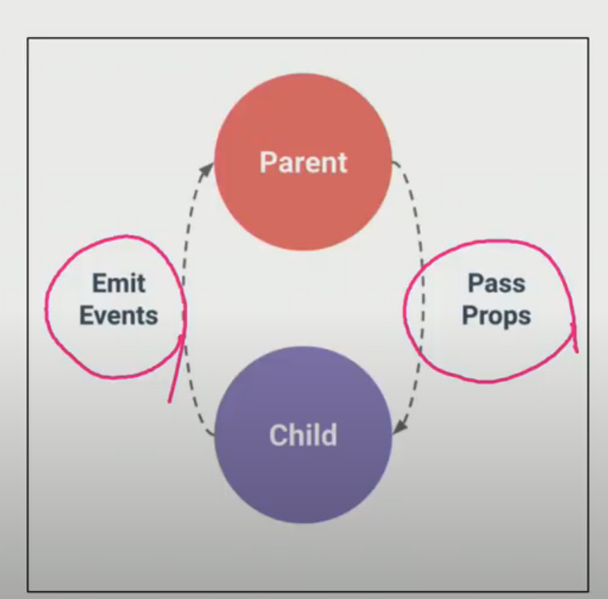

## vue

- template
- script
- style

세가지로 나뉨 (html / javascript / css)




- props : 부모가 => 자식 / 상위 컴포넌트의 정보를 전달하기 위한 특성

  주의 : 하위 컴포넌트의 템플릿에서 상위 데이터를 직접 참조 X

- events : 자식 => 부모

child - input -change : 자식으로부터 데이터를 받으면 함수 실행

**데이터는 반드시 함수여야함!!**

### router

router - link 가 App.vue 최상단에 생기고, router-link 는 클릭 이벤트를 차단하여 브라우저가 페이지를 다시 로드하지 않도록 함.
a 태그지만 우리가 알고 있는 GET 요청을 보내는 a 태그와 조금 다르게 기본 GET 요청을 보내는 이벤트를 제거한 형태로 구성

라우터 뷰 에 나오는 부분을 views 폴더안에 구성 (수업 땐)

```vue
<template>
  <div id="app">
    <div id="nav">
      <router-link to="/">Home</router-link> |
      <router-link to="/about">About</router-link>
    </div>
    <router-view/> <!-- 랜더링 되는 공간 ->>
  </div>
</template>
```

### components vs Views

- App.vue : 최상위 컴포넌트
- views/ : 라우터에 매핑되는 컴포넌트를 모아두는 폴더
  ex) App 컴포넌트 내부에 About & Home 컴포넌트 등록
- components : router에 매핑된 컴포넌트 __내부에__ 작성하는 컴포넌트를 모아두는 폴더
  ex) Home 컴포넌트 내부에 HelloWorld 컴포넌트 등록

