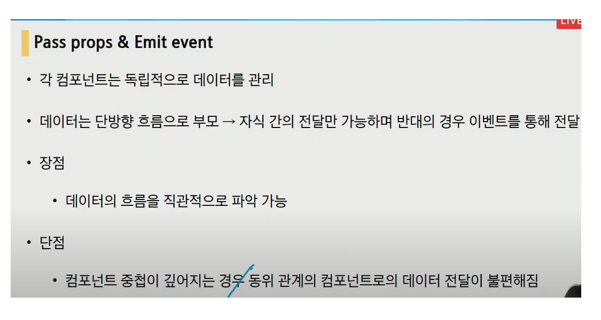
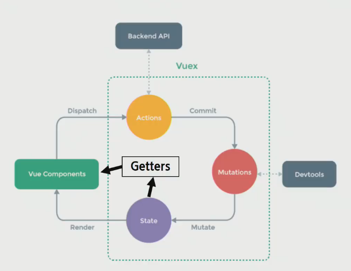

# Vuex

- Statement management pattern + library for vue.js
  - 상태 관리 패턴 + 라이브러리

- 상태를 전역 저장소로 관리할 수 있도록 지원하는 라이브러리

  - state가 예측가능한 방식으로만 변경될 수 있도록 보장하는 규칙 설정

  - 애플리케이션의 모든 컴포넌트에 대한 __중앙 집중식 저장소__ 역할

- Vue의 공식 devtools와 통합되어 기타 고급 기능을 제공

### State

- state는 data이며, 해당 어플리케이션의 핵심이 되는 요소
- 각 컴포넌트에서 관리 (.html의 경우 new Vue ({}), SFC에서는 .vue에 해당)
- DOM 은 data(state)에 반응하여 DOM을 렌더링

### vuex 구성요소

1. State

   1. 중앙에서 관리하는 모든 상태 정보 (data)
   2. Mutations에 정의된 메서드에 의해 변경
   3. state가 변화하면 해당 state를 공유하는 컴포넌트의 DOM은 (알아서) 렌더링

   

2. Actions

   1. state를 직접 변경하지 않고 mutations에 정의된 메서드를 호출해서 변경
   2. Component에서 dispatch()메서드에 의해 호출
   3. 동기적인 작업 뿐만 아니라 비동기적인 작업을 포함 가능
   4. 항상 context가 인자로 넘어옴
      1. store.js파일 내에 있는 모든 요소에 접근해서 속성 접근 & 메서드 호출이 가능
      2. 단, (가능하지만) state를 직접 변경하지 않음
   5. mutations에 정의된 메서드를 commit 메서드로 호출
   6. state는 오로지 mutations 메서드를 통해서만 조작

   

3. Mutations

   1. state를 변경하는 로직
   2. Actions에서 **commit()** 메서드에 의해 호출
   3. 비동기적으로 동작하면 state가 변화하는 시점이 달라질 수 있기 때문에 **동기적인 코드**만 작성
   4. mutations에 정의하는 메서드의 첫 번째 인자로 state가 넘어옴

4. Getters

   1. state를 변경하지 않고 활용하여 계산을 수행 (computed와 유사)
      1. state에 todo list의 해야 할 일의 목록의 경우 todo가 완료된 목록만 필터링해서 보여줘야하는 경우
      2. getters에서 completed의 값이 true인 요소가 필터링 해서 계산된 값을 담아 놓을 수 있음
   2. getters 자체가 state 자체를 변경하지는 않음

   

### 정리

1. 컴포넌트에서 `dispatch` 를 활용해 actions를 호출
2. action에 정의된 메서드는 commit을 활용해 mutations를 호출
3. mutations에 정의된 메서드는 state를 조작한다.

