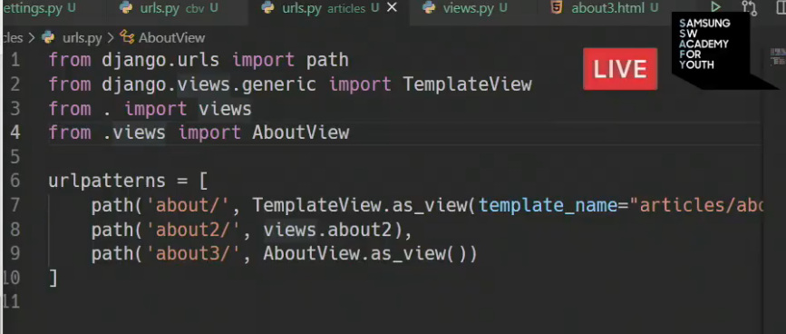

- TemplateView.as_view : 템플릿(html)을 보여주는(render) 기능 (바로 html)

- views.about2 : 여태까지 늘 썼던 방법 views.py 에 function을 이용
- AboutView.as_view() : 앞으로 제일 많이 쓸 방법 class_based_view

### views.py

- 함수 구현

- 클래스로 구현한 것

